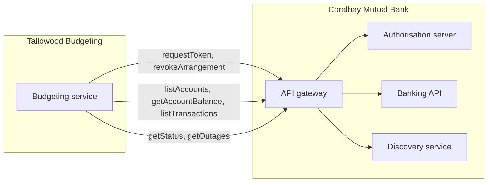

# Components

The [overview](./overview.md) shows how the components connect. This page maps
them to the API operations.

| Component | Operations served |
|---|---|
| Authorisation server | [requestToken](/docs/api/consent/request-token), [revokeArrangement](/docs/api/consent/revoke-arrangement) |
| Banking API | [listAccounts](/docs/api/banking/list-accounts), [getAccountBalance](/docs/api/banking/get-account-balance), [listTransactions](/docs/api/banking/list-transactions) |
| Discovery service | [getStatus](/docs/api/common/get-status), [getOutages](/docs/api/common/get-outages) |
| API gateway | All. It checks the token (see the [security profile](/docs/contracts/security-profile)) and enforces the [traffic thresholds](/docs/contracts/non-functional-requirements) |
