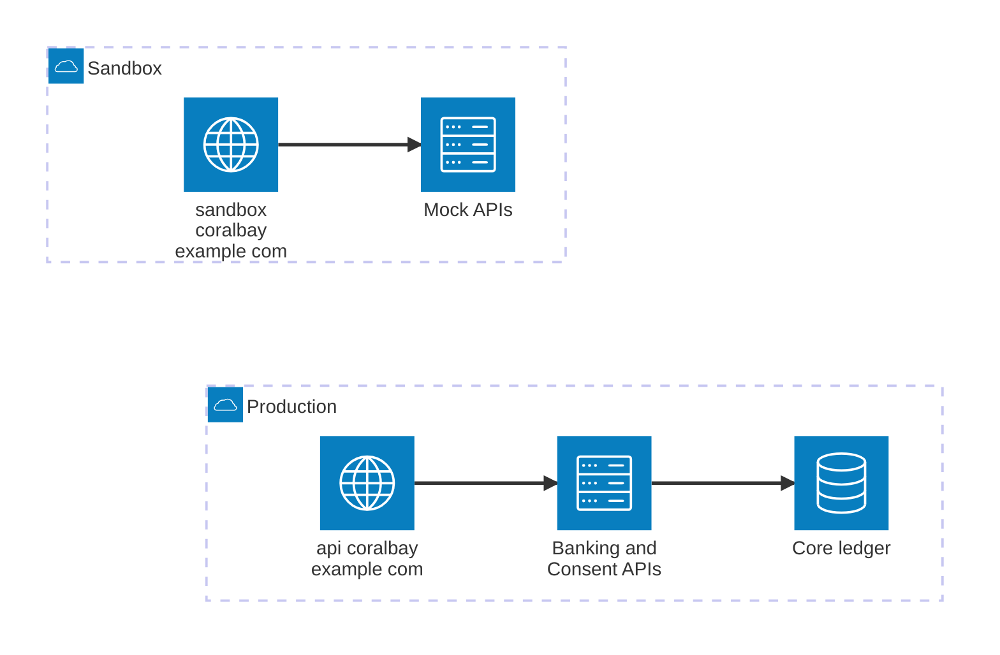

# Deployment

Coralbay Mutual Bank runs two environments. Each API edition points at one of
them.

| Environment | Server | Data | Edition |
|---|---|---|---|
| Production | `https://api.coralbay.example.com/cds-fictitious` | Real accounts (in the story) | Source documents and the [recipient edition](/docs/overlays/recipient) |
| Sandbox | `https://sandbox.coralbay.example.com/cds-fictitious` | Example responses only | The [sandbox edition](/docs/overlays/sandbox) |

In this repository, the sandbox is simulated by a local mock server, which
`npm run arazzo:test` starts for the [workflows](/docs/workflows).
