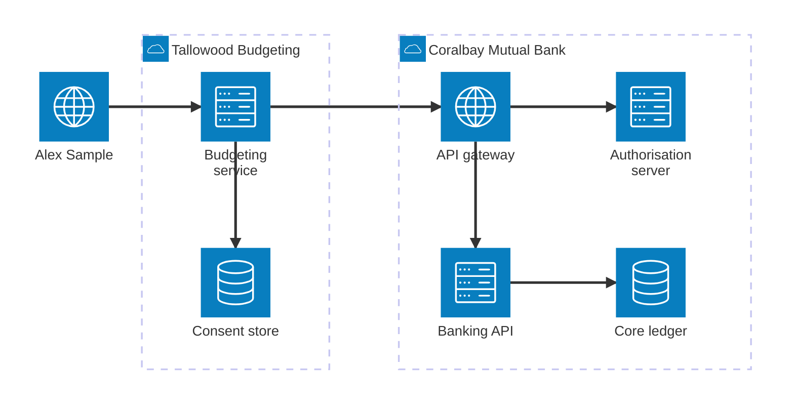

# Architecture overview

Three parties take part in each data sharing arrangement:

* **Coralbay Mutual Bank**, the data holder. It publishes the Banking, Common
  and Consent APIs.
* **Tallowood Budgeting**, the data recipient. It calls those APIs with the
  consumer's consent.
* **Alex Sample**, the consumer. Alex gives and withdraws consent.

The diagram shows the components and the direction of each call.

| Component | Owner | Responsibility |
|---|---|---|
| API gateway | Coralbay Mutual Bank | Terminates TLS, checks the access token, routes calls |
| Authorisation server | Coralbay Mutual Bank | Authenticates Alex, records consent, issues tokens |
| Banking API | Coralbay Mutual Bank | Serves accounts, balances and transactions |
| Core ledger | Coralbay Mutual Bank | Holds the account data. It is not exposed directly |
| Budgeting service | Tallowood Budgeting | Calls the APIs and builds Alex's budget |
| Consent store | Tallowood Budgeting | Keeps the arrangement identifier and token state |
