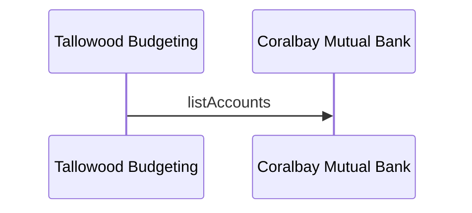

# Add a diagram

Write the diagram in a fenced block with the language `mermaid`:

````md

````

All Mermaid diagram types that Mermaid 12 supports work, including
`architecture-beta`. See the [architecture overview](/docs/architecture/overview)
for an example.

## Check it renders

A broken diagram does not break the build. Run the render test:

```bash
npm run build
npm run test:render
```

The test counts the Mermaid blocks in each page's source, then checks that the
browser shows the same number of rendered diagrams, with no syntax error.

## Rules

* Do not set `slug` in a page's frontmatter. The render test derives each
  page's address from its folder and `id`.
* Only use `architecture-beta` icons that Mermaid provides without an icon
  pack: `cloud`, `database`, `disk`, `internet` and `server`.
