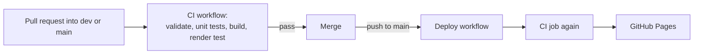

# Deployment

| Workflow | File | Runs on | Does |
|---|---|---|---|
| CI | `.github/workflows/ci.yml` | Pull requests into `dev` and `main` | All checks, then uploads the built site |
| Deploy | `.github/workflows/deploy.yml` | Pushes to `main`, and manual runs | The CI job, then publishes its built site to GitHub Pages |

## One-time setup by the repository owner

In the repository settings, set **Pages → Build and deployment → Source** to
**GitHub Actions**. Until then, the deploy job fails at the
`configure-pages` step. The CI checks still run.

## Published address

`https://amjadleghari.github.io/ConsumerDataStandards/`

The address comes from `url` and `baseUrl` in `docusaurus.config.ts`. If the
repository is renamed or moved, change both.
