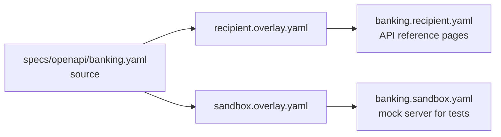

# Overlays

An [OpenAPI Overlay](https://spec.openapis.org/overlay/v1.0.0.html) is a
separate document that changes an OpenAPI document without editing it. Each
action names a target with a JSONPath expression, and then updates or removes
what the target selects.

The FDSC keeps one source document per API in `specs/openapi/`. Two overlays
produce the editions that people use:

| Overlay | Produces | Used by |
|---|---|---|
| [Data recipient edition](./recipient.md) | `specs/generated/<api>.recipient.yaml` | The [API reference](/docs/api/banking/banking-api) on this site |
| [Sandbox edition](./sandbox.md) | `specs/generated/<api>.sandbox.yaml` | The mock server that tests the [workflows](../workflows/index.md) |

`npm run specs:overlay` applies both overlays to all three APIs, then checks
that each overlay had its effect. An overlay action whose target matches
nothing does not cause an error in the tool, so the check is what catches a
mistyped target.
