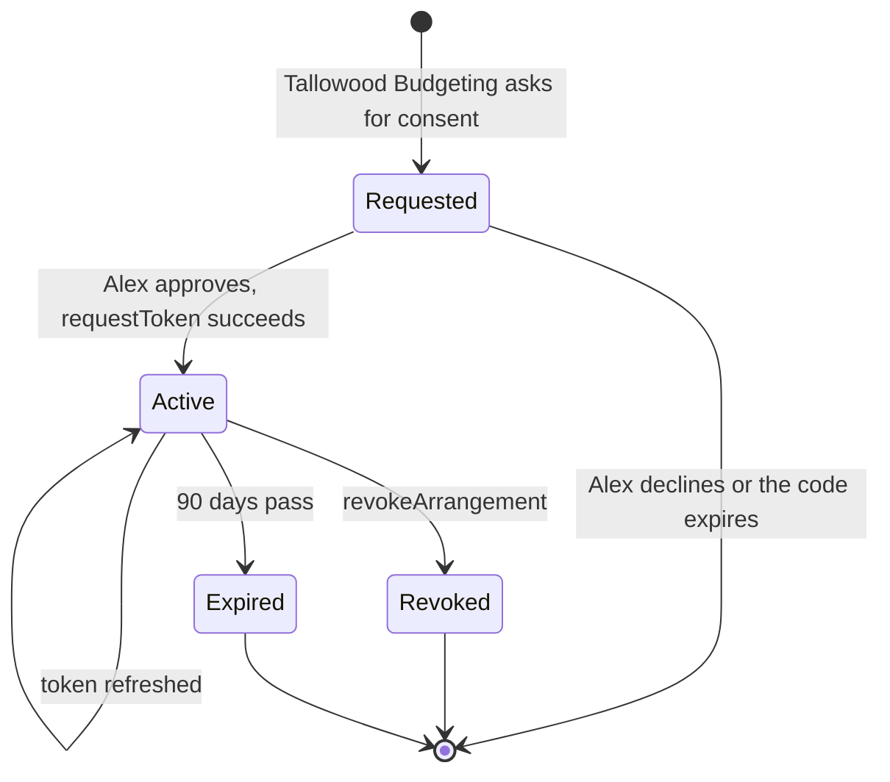

# Consent lifecycle

A data sharing arrangement is always in one of four states.

| State | Meaning | Calls that succeed |
|---|---|---|
| Requested | Alex has not approved yet | None with a token |
| Active | The arrangement is in force | Every operation in the [Banking API](/docs/api/banking/banking-api), within the approved scope |
| Revoked | Alex withdrew consent | None. Calls return `401` with `urn:fdsc:error:authorisation:revoked`, see the [error model](/docs/contracts/error-model) |
| Expired | The duration ended | None. Calls return `401` |

## Events

| Event | Caused by | API |
|---|---|---|
| Approve | Alex, at Coralbay Mutual Bank | Browser redirect, then [requestToken](/docs/api/consent/request-token) |
| Revoke | Alex, in Tallowood Budgeting | [revokeArrangement](/docs/api/consent/revoke-arrangement), see the [Revoke an arrangement](/docs/workflows/generated/revoke-arrangement) workflow |
| Expire | Time | None |
