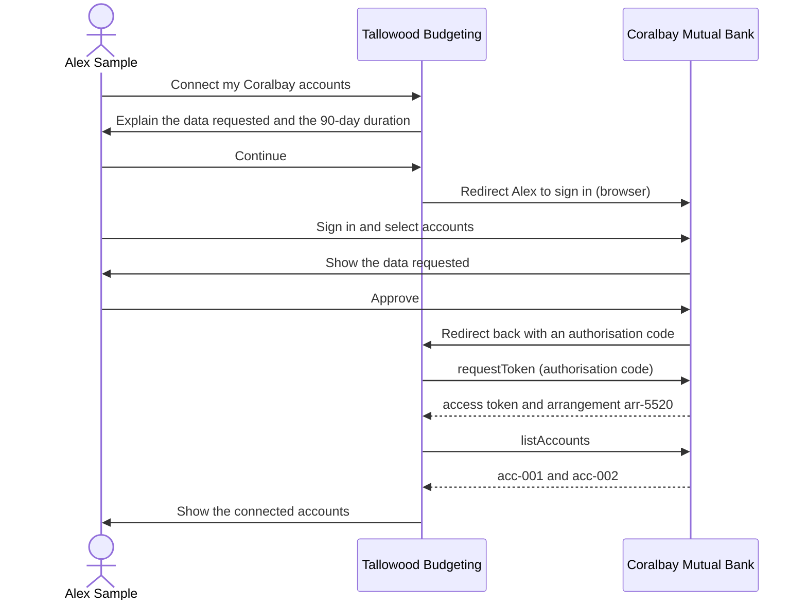

# Consumer journey

This page follows Alex Sample through the journey. The API calls behind each
step are in the [Establish consent](/docs/workflows/generated/establish-consent)
workflow.

## Steps

1. **Ask.** Tallowood Budgeting tells Alex which data it will read (accounts,
   balances, transactions), why, and for how long (90 days).
2. **Authenticate.** Alex signs in to Coralbay Mutual Bank. Tallowood Budgeting
   never sees Alex's banking password.
3. **Authorise.** Alex selects the accounts to share and approves. The bank
   records the consent.
4. **Connect.** Tallowood Budgeting exchanges the authorisation code with
   [requestToken](/docs/api/consent/request-token), then calls
   [listAccounts](/docs/api/banking/list-accounts).
5. **Withdraw.** At any time, Alex can withdraw consent in the app. Tallowood
   Budgeting then calls [revokeArrangement](/docs/api/consent/revoke-arrangement).

The rules that apply to the token and the redirect are in the
[security profile](/docs/contracts/security-profile).
