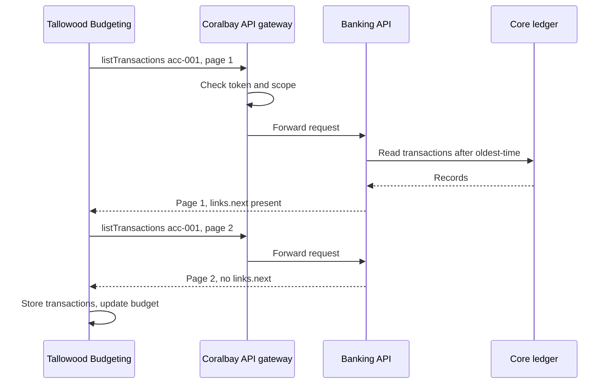

# Data flow

Tallowood Budgeting synchronises Alex's transactions once a day. The
[Synchronise transactions](/docs/workflows/generated/sync-transactions)
workflow describes the calls.

## What moves, and what does not

| Data | Moves to Tallowood Budgeting | Rule |
|---|---|---|
| Account display name and masked number | yes | [listAccounts](/docs/api/banking/list-accounts) |
| Balances | yes | [getAccountBalance](/docs/api/banking/get-account-balance) |
| Transactions | yes, page by page | [listTransactions](/docs/api/banking/list-transactions), [pagination contract](/docs/contracts/pagination) |
| Full account number | no | Only the masked number is shared |
| Holder metrics | no | Removed from the recipient edition by the [recipient overlay](/docs/overlays/recipient) |

Traffic limits for this flow are in the
[non-functional requirements](/docs/contracts/non-functional-requirements).
