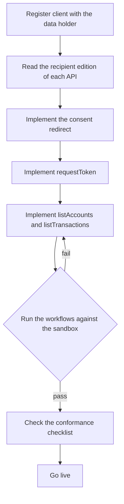

# Implementation guide

This guide is for a data recipient. It uses Tallowood Budgeting as the example.

## 1. Register

Register a client identifier with each data holder. Tallowood Budgeting uses
`tallowood-budgeting` with Coralbay Mutual Bank.

## 2. Read the recipient edition

Use the [API reference](/docs/api/banking/banking-api). It is generated from the
[data recipient edition](/docs/overlays/recipient), which leaves out
operations that only the data holder may call.

## 3. Implement the calls in order

Follow the three workflows. They give the order of calls and the values that
pass from one step to the next:

* [Establish consent and read accounts](/docs/workflows/generated/establish-consent)
* [Synchronise transactions](/docs/workflows/generated/sync-transactions)
* [Revoke an arrangement](/docs/workflows/generated/revoke-arrangement)

## 4. Apply the contracts

Every call must meet the [versioning](/docs/contracts/versioning),
[error model](/docs/contracts/error-model),
[pagination](/docs/contracts/pagination) and
[security](/docs/contracts/security-profile) contracts.

## 5. Test against the sandbox

The [sandbox edition](/docs/overlays/sandbox) points at the fictitious sandbox
server. This repository runs the same workflows against a local mock with
`npm run arazzo:test`.

## 6. Check conformance

Work through the
[recipient conformance checklist](/docs/contracts/recipient-conformance-checklist)
before going live.
